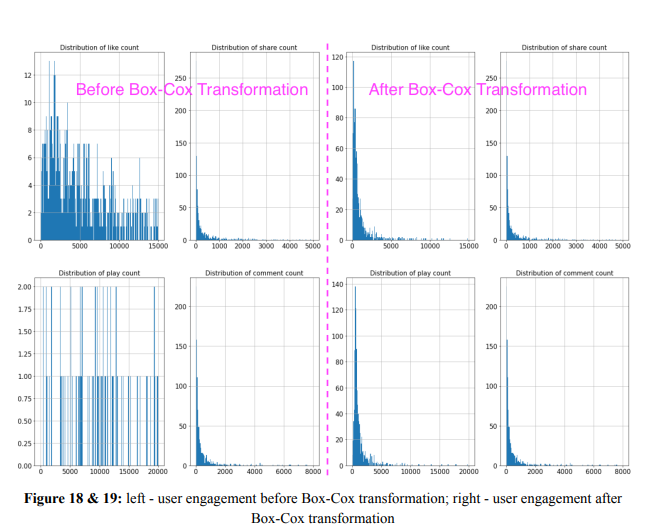

### Data Analysis for Trending Content and Top Influencers on Social Media Platforms

    <!-- Python -->
    
    <!-- PLUS SIGN -->
    
    <!-- Jupyter Notebook -->
    
    <!-- PLUS SIGN -->
    
    <!-- Github -->
    

This project analyzed social media influencers on platforms like Instagram, YouTube, and TikTok to understand engagement patterns and identify key factors contributing to influencer success. Using data from Kaggle, I focused on analyzing influencer categories, engagement metrics, and subscriber growth.

*Figure 1: The Box-Cox transformation was applied to normalize skewed data distributions for more accurate statistical analysis.*

*Figure 2: Distribution of Top Influencers by Genre.*

**Key Insights**:
Dominant Categories: The Music and Music & Dance categories were the most popular (*shown in figure 2*), with Instagram and YouTube influencers in these categories having the highest total follower counts.

**Engagement Analysis**: There was a strong correlation between Authentic Engagement and Average Engagement on Instagram, indicating that influencers with high-quality interactions receive higher overall engagement.

**Platform Comparison**: Instagram was the top platform by total followers, followed by YouTube and TikTok.

**Technical Highlights**: Cleaned and normalized the dataset by removing duplicates and converting values with abbreviations (e.g., 'M', 'K') into numeric formats.
Applied Box-Cox Transformation to normalize skewed data distributions (*shown in figure 1*), improving the accuracy of correlation analysis and predictive modeling.
