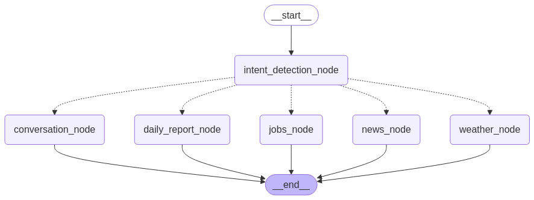

# Personal AI Agent with LangGraph

## Project Overview

An orchestrated AI agent system built with LangGraph that provides personalized information through multiple specialized nodes. The agent can detect user intent and route requests to appropriate service nodes for daily reports, job searches, news updates, and weather information.



## Technical Architecture

This project implements a multi-node AI agent system with:

- **Intent Detection**: Core routing logic using Phi-4 to analyze user queries and direct to appropriate nodes
- **LangGraph Orchestration**: Directed graph workflow for flexible agent behavior
- **Specialized Service Nodes**:
  - `conversation_node`: General dialog capabilities.
  - `daily_report_node`: Aggregated daily information summaries. This is the combination of job, news, and weather reports into a PDF file. 
  - `jobs_node`: Employment opportunity tracking. Can be filterted by location, job title, dates, salary, and job types.
  - `news_node`: Current events monitoring. Can be filtered by title, descriptions, keywords , sources, and publication sites.
  - `weather_node`: Weather condition reporting. Can be filtered by location name.

## Key Technologies

- **LangGraph**: Orchestration framework for building complex AI agent workflows.
- **FastAPI**: Backend API framework for service endpoints.
- **Ollama**: Local deployment of Phi-4 model for efficient inference.
- **Quantized Models**: Optimized Phi-4 for improved performance on consumer hardware.
- **Conda**: Environment management for reproducibility.

## Current Implementation

The system runs in a Conda environment with the following features:

- Intent detection for routing user queries
- Multiple specialized agent nodes
- FastAPI endpoints for each service node
- Local model inference via Ollama
- Directed graph workflow with proper state management

## Deployment Roadmap

- **Current**: Local execution in Conda environment
- **Stage 1**: Docker containerization (in progress)
- **Stage 2**: Kubernetes deployment for scalability
- **Stage 3**: CI/CD pipeline integration
- **Stage 4**: Monitoring and observability implementation

## Getting Started

### Prerequisites

- Conda
- Python 3.10+
- Ollama with Phi-4 model
  - Made sure that you have Ollama with Unsloth Phi-4 model downloaded

### Installation

```bash
# Clone the repository
git clone https://github.com/yourusername/ai-agent-project.git
cd ai-agent-project

# Create and activate the conda environment
conda env create -f environment.yml
conda activate ai-agent-env

# Start the Ollama server (in separate terminal)
ollama run phi:4

# Start the FastAPI server
uvicorn app.main:app --reload
```

### Setting up API Keys
This project requires API keys for certain services:

1. Open secrets.json and input the following API keys:
    - `mediastack_api_key`: For news retrieval (may incur charges)
    - `jsearch_api_key`: For job listings (may incur charges)

The weather report functionality uses direct API calls to the weather.gov database, which is free but has daily usage limits. 

### Usage

```bash
# Once you have the conda env set up, Ollama and Phi4 model downloaded, and API key input, simply run
cd src
python basic_report_agent.py
```

## Docker Support (Coming Soon)

```bash
# Build the Docker image
docker build -t ai-agent:latest .

# Run the container
docker run -p 8000:8000 ai-agent:latest
```

## Future Development

- Enhanced intent recognition with fine-tuned models
- Additional specialized agent nodes (calendar, tasks, etc.)
- Improved state management and conversation memory
- User authentication and personalization
- Kubernetes deployment for horizontal scaling

## Contributing

Contributions are welcome! Please feel free to submit a Pull Request.

## License

This project is licensed under the MIT License - see the LICENSE file for details.
